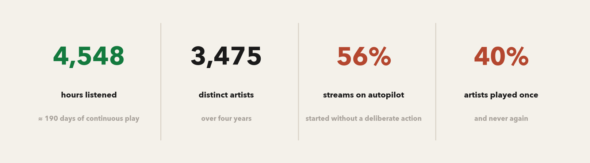
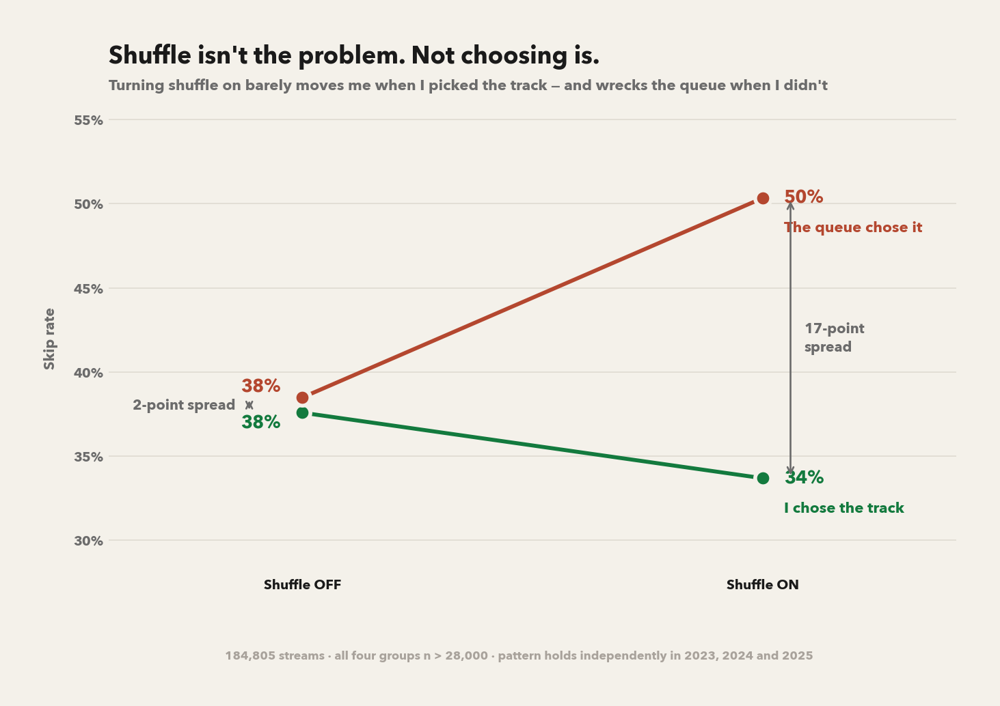
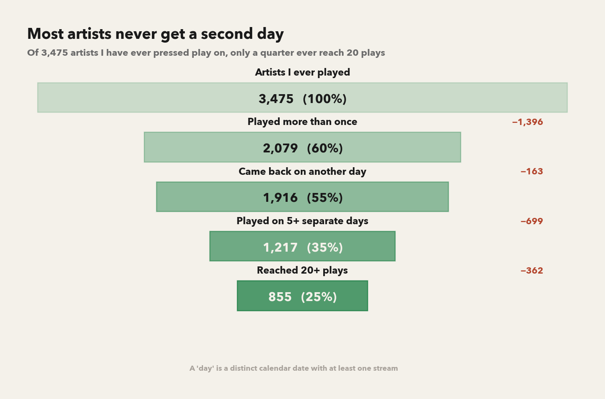
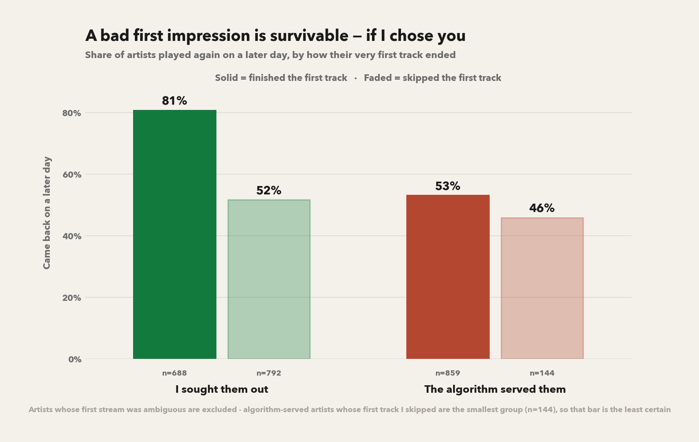
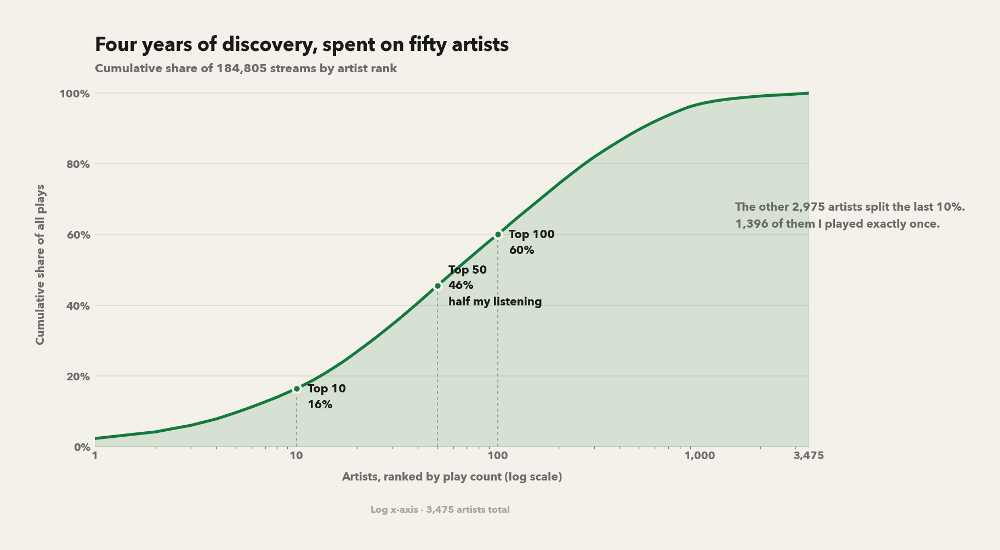

# Do I Choose My Music, or Does It Choose Me?

**A 4-year behavioral analysis of 184,805 Spotify streams (Oct 2021 – Oct 2025)**

[**→ Interactive dashboard on Tableau Public**](https://public.tableau.com/app/profile/medha.subramaniyan/viz/DoIChooseMyMusicorDoesItChooseMeA4-YearSpotifyBehaviorAnalysis/Dashboard3)

---



## The question

Streaming platforms are built to remove decisions. Autoplay, radio, and
algorithmic queues all make it easy to keep listening without ever choosing to.
So I pulled my own extended streaming history and asked a question I couldn't
answer by intuition:

> **When I listen to music, am I choosing it — or is it choosing me?
> And does it matter which?**

The second half is the part worth answering. If algorithmic listening produced
the same relationships with artists as deliberate listening, "autopilot" would
be a neutral convenience. This analysis tests whether it does.

## Defining intentionality

The whole analysis rests on one judgment call, so I made it explicitly before
writing any query. Every stream carries a `reason_start` field, which I split
into three groups:

| Class | `reason_start` values | Reading |
|---|---|---|
| **Deliberate** | `clickrow`, `playbtn`, `backbtn` | I picked this track |
| **Passive** | `trackdone`, `autoplay`, `appload` | The queue picked it |
| **Ambiguous** | `fwdbtn`, `remote`, others | Intent unclear — kept separate, never merged |

Two decisions matter here:

- **`fwdbtn` is ambiguous, not deliberate.** Pressing skip-forward is a physical
  action, but it usually rejects a track rather than choosing the next one.
  Counting it as intent would have inflated the headline metric.
- **Ambiguous stays its own category.** Roughly 1,000 artists fall here.
  Folding them into either side would have quietly moved the answer, so they're
  reported as a third line throughout.

Supporting definitions: a **session** ends after 30 minutes of inactivity
(industry convention); a stream counts as a **real listen** at ≥30 seconds; an
artist's **discovery method** is the class of their very first stream.

## What I found

The [Tableau dashboard](https://public.tableau.com/app/profile/medha.subramaniyan/viz/DoIChooseMyMusicorDoesItChooseMeA4-YearSpotifyBehaviorAnalysis/Dashboard3)
covers the descriptive layer — the intentionality trend, cohort retention
curves, a skip heatmap and session anatomy. Rather than restate it here, this
write-up goes after four questions the dashboard doesn't ask, working from the
stream-level data instead of the aggregates behind it.

### 1. Shuffle isn't the villain — not choosing is



This is the finding I didn't expect. Looked at on its own, shuffle appears
terrible for engagement. But split by intent, the average is hiding an
interaction:

| | Shuffle OFF | Shuffle ON |
|---|---|---|
| **I chose the track** | 38% | **34%** *(skip rate falls)* |
| **The queue chose it** | 38% | **50%** *(skip rate jumps)* |

With shuffle off, intent barely matters — both groups skip at 38%. Turn
shuffle on and the two diverge by 17 points. Shuffle *improves* a session I
started deliberately and wrecks one I didn't.

The interaction is not noise: all four cells have n > 28,000, the confidence
intervals don't overlap, and the pattern reproduces independently in 2023,
2024 and 2025.

### 2. Most artists never get a second day



The dashboard's retention curves show *rates*; this shows the raw attrition
behind them. Of 3,475 artists, 1,396 were played exactly once and never again.
Only a quarter ever reached 20 plays. Discovery is cheap and abundant;
attention is the scarce resource.

### 3. A bad first impression is survivable — if I chose you



Whether I skipped an artist's very first track predicts whether they ever come
back — but the penalty is not symmetric:

- **Artists I sought out:** 81% return after a completed first track, 52% even
  after I skipped it — a **29-point** penalty.
- **Artists the algorithm served:** 53% and 46% — only a **7-point** penalty.

Deliberate discovery buys an artist a second chance. Algorithmic discovery
starts them near the floor, so a skip barely moves them. Caveat on the chart:
the served-and-skipped cell is small (n=144).

### 4. Four years of discovery, spent on fifty artists



3,475 artists, but the top 50 take 46% of all plays and the top 100 take 60%.
The remaining 2,975 split the last 10%. Whatever the algorithm is doing to
broaden what I hear, it isn't broadening what I actually *listen to*.

## The answer

Both, but not equally, and the balance shifted.

The mechanism isn't the features people blame. Shuffle is fine — it *lowers*
my skip rate on sessions I started deliberately. What predicts restlessness is
whether a choice happened at all, and how long ago it happened.

The algorithm supplies the majority of what I play — 56% of streams began
without a deliberate action. But it's a poor curator of anything lasting.
Artists it introduced don't get the second chance a chosen artist gets after a
bad first track (7-point penalty vs. 29), and the listening it generates piles
onto the same fifty artists rather than widening the rotation. Deliberate
choice is the smaller share of my listening and the one that produces most of
what stays.

The dashboard adds the time dimension the charts here don't: deliberate starts
fell from 52% in 2021 to 40% in 2025, and skip rate climbs from 30% on a
session's first track to 58% past track 100.

The honest caveat: this is one person's data. It shows a real association
between how an artist entered my library and how long they lasted — not proof
that choosing *causes* attachment. Someone who deliberately seeks out an artist
may already be predisposed to like them, which would produce this same pattern.

## Method

```
Spotify Extended Streaming History (12 JSON files)
  └─ pandas: profile → clean → engineer intentionality, sessions, cohorts
      └─ spotify_cleaned.parquet  (184,805 streams × 26 columns)
          ├─ DuckDB: window functions, cohort retention, skip fingerprints
          │     └─ 6 aggregate CSVs → Tableau Public dashboard
          └─ make_supplement.py (reads the parquet directly)
                └─ the four charts in this README
```

The charts here read the stream-level parquet rather than the aggregate CSVs,
because the CSVs were shaped around the dashboard's questions. A *conditional*
result like the shuffle × intent interaction can't be recovered from a table
that has already averaged over intent — it only exists at the row level.

**Pipeline decisions**

- Video streaming history excluded — keeps the story about music.
- Streams under 30 seconds dropped as accidental taps.
- Spotify's `skipped` flag disagrees with `reason_end` in places; I derived skips
  from `reason_end` and documented the choice rather than trusting the flag.
- Session IDs built with a `.diff()` on sorted timestamps, then validated in SQL
  with `LAG(ts) OVER (ORDER BY ts)`.
- Retention computed as a cohort survival curve keyed on each artist's first
  stream month.

**Files**

| File | What it is |
|---|---|
| `cleaning.ipynb` | Profiling, cleaning, feature engineering, SQL analysis |
| `make_supplement.py` | The four charts in this README |
| `charts/` | Generated figures |
| `*.csv` | Aggregate outputs feeding both Tableau and matplotlib |
| `spotify_cleaned.parquet` | Clean stream-level table (source of truth) |
| `Spotify Extended Streaming History/` | Raw JSON export |

**Reproduce the charts**

```bash
pip install pandas matplotlib numpy pyarrow
python make_supplement.py   # writes the charts used in this README
```

## Design note

The dashboard is styled as the product: Spotify's own `#121212` and `#1DB954`,
so it reads like the app it describes. These charts deliberately don't match
it.

| Role | Hex | |
|---|---|---|
| Ground | `#F4F1EA` | warm paper, not app-dark |
| Deliberate | `#137A3E` | green, deepened for a light ground |
| Algorithmic | `#B4472F` | clay — a warm counterweight, not a dead gray |
| Ink | `#1A1A1A` | near-black, never pure |

Two reasons for the shift. Practically, a light ground survives being embedded
in a README, printed, or dropped into a slide, where a dark dashboard
screenshot usually doesn't. Editorially, these charts argue past the dashboard
rather than summarizing it, and the change of ground tells the reader that
before they read a single label.

What carries over is the encoding: **green means deliberate, and it never
swaps.** Learn it in the KPI row and every chart below is readable without a
legend — which is why the slope chart can drop its legend entirely and let the
two diverging lines carry the argument on their own.

One form choice worth naming: chart 1 is a slope graph rather than four bars.
The finding *is* the divergence — two lines that start together and separate —
and a bar chart would have made that a comparison you calculate instead of one
you see.

---

*Data: personal Spotify Extended Streaming History, requested via Spotify's
privacy dashboard.*
